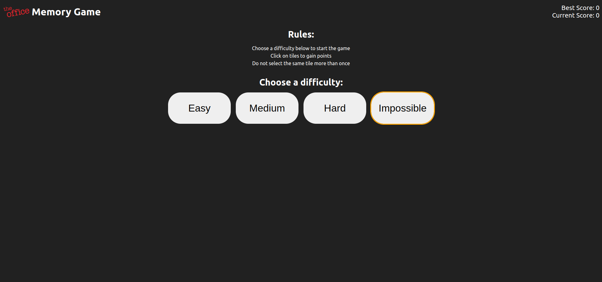
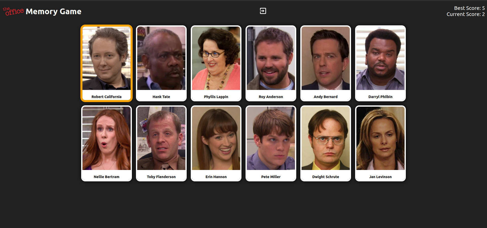
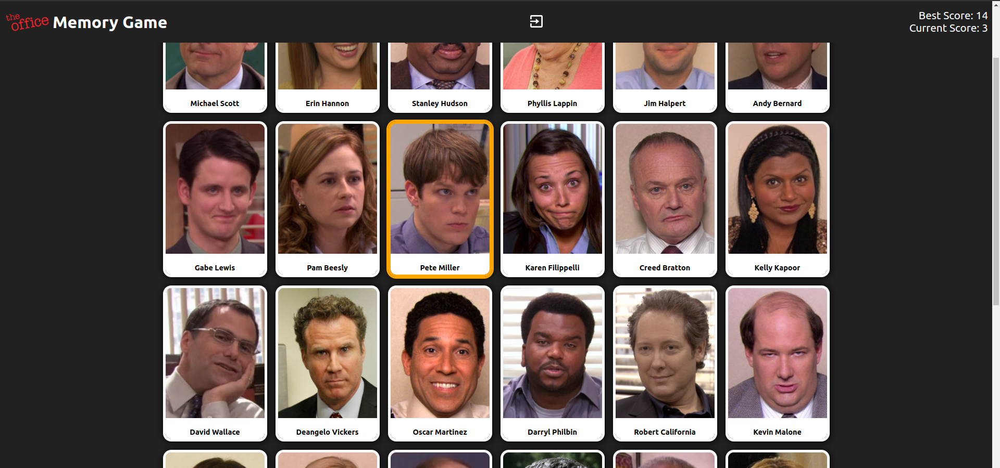

# The Office Memory Game

[See the project live](https://mckensis.github.io/memory-card)

## About the project

- A memory game featuring characters from the American TV show 'The Office'
- Built with React Functional Components
- Heavily utilises React Hooks 

## How to Play

1. Choose a difficulty...
2. Feeling like a Kevin? Choose Easy mode, buddy.
3. Feeling like an Oscar? Impossible mode is the one for you!
4. Click on characters to earn points.
5. If you click on the same character more than once, your current score will reset to zero and the board will reset.

## Screenshots

## Future Improvements

1. Implement a database to store high scores. Can anyone get 30 points in impossible mode?!